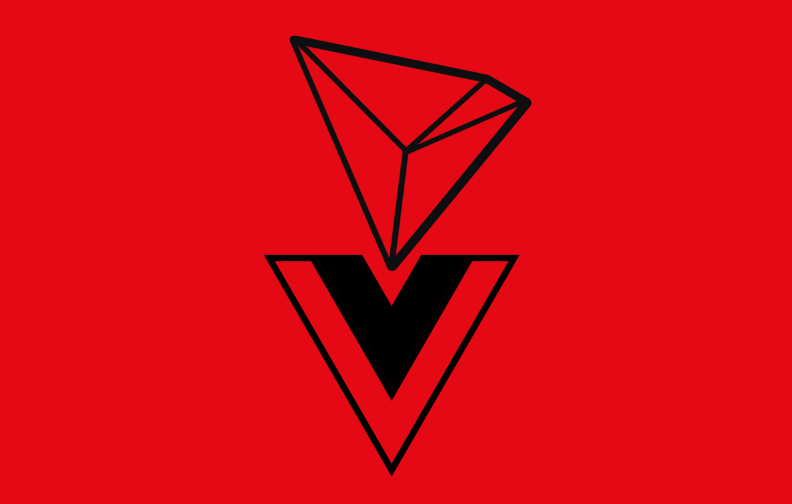
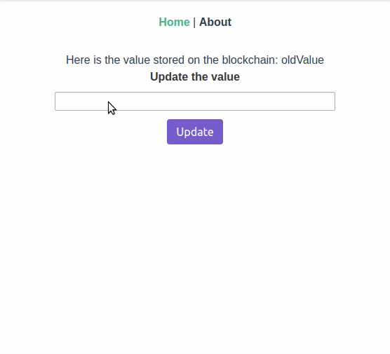

# Tron starter dApp

<p align="center">		
  		
</p>

This project was generated with [vue-cli](https://github.com/vuejs/vue-cli) version 3.2.1

# Demo
Update a value of a smart contract with your Tronlink wallet address



# Project setup
A TronLink account is required for this dApp to work!

Download Tronlink [here](https://chrome.google.com/webstore/detail/tronlink/ibnejdfjmmkpcnlpebklmnkoeoihofec)

### Clone the repo:
```
git clone https://github.com/marlowl/vue-truffle-starter-dapp/
```
### Install dependencies
```
npm install
```
### Update the .env file
```
VUE_APP_SHASTA_PRIVATE_KEY="Your key"

```
### Tronbox: compile and migrate your own smart contracts
```
npm install -g tronbox
tronbox compile
tronbox migrate --network shasta
```

### Compiles and hot-reloads for development
```
npm run serve
```

### Compiles and minifies for production
```
npm run build
```

### Run your tests
```
npm run test
```

### Lints and fixes files
```
npm run lint
```

### Run your end-to-end tests
```
npm run test:e2e
```

### Run your unit tests
```
npm run test:unit
```
